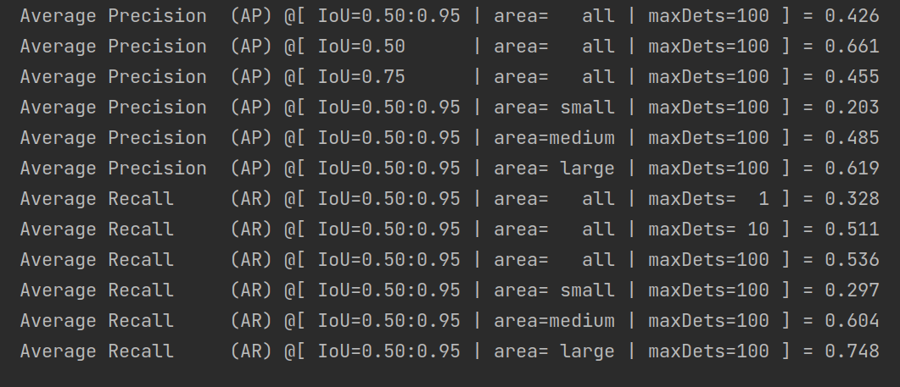

# TF Keras YOLOv4

## 目录
1. [介绍](#1、介绍)
2. [环境](#2、环境)
3. [权重文件](#3、权重文件)
4. [性能情况](#4、性能表现)

## 1、介绍
此工程/demo源码来自：https://github.com/david8862/keras-YOLOv3-model-set

基于上面源码，进行解耦注释和改动，最终提取出完整的 yolov4 网络模型。

### 1.1 文件夹介绍
- `yolo_component` 文件夹存储的是网络组成部件，具体介绍如下：
  - `a_darknet.py`： 
    - 定义 Yolov4 的 `backbone`（csp_darknet53） 
    - 一些组件层的定义（例如mish）存放在 `z_layers.py`
  - `b_neck_and_body.py`：
    - 定义 Yolov4 的 `neck` 部分（FPN+PAN结构）以及整体网络的body（输入图片，输出三张特征图）
    - 一些组件层的定义（例如SPP）存放在 `z_layers.py`
  - `c_postprocess.py`：
    - 定义 Yolov4 的 `prediction`部分（处理特征图，并做一些处理包括nms得到预测 boxes, scores, classes）
    - 一些组件的存放在 `z_layers.py`
  - `z_layers.py`：
    - 定义各种网络构建中需要的组件
      - darknet_Conv2D
      - darknet_CBM
      - darknet_CBL
      - spp
      - ...
    
  - `z_decode.py`：
    - 定义预测框解码真实框的相关函数
  - `z_loss.py`
    - 定义损失函数相关组件，包括：
      - _smooth_labels
      - sigmoid_focal_loss
      - softmax_focal_loss
      - box_iou
      - box_diou
      - ...
  
- `weights` 文件夹存放的是 Yolov4 （以 csp_darknet53 为 backbone，以 COCO 检测任务/80 类别为目标类别训练的模型的权重）。
  下载地址，在右侧的`Release`中。
  
- `utils` 文件夹中存放的模型处理数据，绘图等会使用到的一些工具模块。几个模块以及内部函数定义都易懂，不做过多解释。

- `configs` 文件夹中存放相关配置文件
  - `coco_classes.txt`：
    - coco 数据集的类别信息，共80类
  - `voc_classes.txt`：
    - voc 数据集的类别信息，共20类
  - `yolo_anchors.txt`：
    - yolov4 先验框 anchor 的相关信息
  
- `tools` 文件夹存放的目前只有评估工具 `evaluation`
  - `coco_gt_generator.py`：
    - 该工具利用 `coco201x/annotations/y.json`信息来生成真实框的相关信息
      - 这里 x 指年份，y 根据任务来，此demo是检测任务，所以是 `instances_val2017.json`
      - 代码中的数据地址都是本地的绝对地址，运行时自行替换
  - `coco_result_generator.py`：
    - 该工具利用上面工具生成的文件，读取对应图片，使用训练的模型进行评估，并将其结果保存为 `detection_result.txt`
    - 代码中的数据地址都是本地的绝对地址，运行时自行替换
  - `pycoco_eval.py`
    - 该工具利用 coco 的 api包，首先将上面的评估结果 `detection_result.txt` 转化成 api 要求的格式，
      然后调用 api 进行评估
    
- `img` 文件夹存放一些测试图片，共调试使用
- `outputs` 文件夹存放一些生成文件，例如上面 `tools` 中工具使用时生成的输出文件

### 1.2 文件夹外文件介绍

- `model.py`:
  - `model.py` 文件利用上面 `yolo_componet` 中定义的层、网络结构等定义推理、训练函数
    - `get_yolo4_model`
    - `get_yolo4_inference_model`
    - `get_yolo4_train_model`
  
- `yolo.py`:
  - `yolo.py`定义了 yolo 类，实现了 yolov4 初始化、模型生成、图片检测等功能
  
- `predict_image.py`:
  - 图片检测
  
- `predict_vedio.py`：
  - 视频检测
  
## 2、环境

目前环境是在 `tensorflow-gpu=2.2.0, python= 3.6.13` 下正常运行

环境应该不指定，即 tf、python 其他版本都有可能

暂时没有给出环境配置文件，可以在安装完 tf 后运行文件不断补充所需包。

后期可能会给出相应的环境配置文件。

## 3、权重文件
权重文件在右边的 Release 中有，也可以点击[此处](https://github.com/bobenxia/target_detection/releases/tag/1.0)跳转。

## 4、性能表现
### 20210420-未进行改进的性能表现

fps: 17 (2070机器)

mAP：

